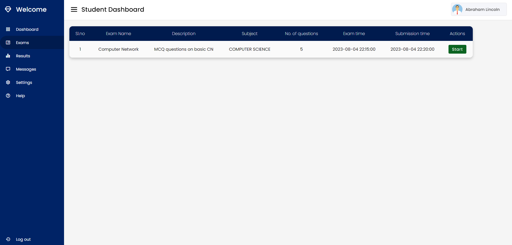

# Online Assessment System :computer:

## Overview 🌟

The Online Assessment System is a feature-rich web application designed for conducting exams in schools or any instances where MCQ exams are applicable. The system consists of two parts: the Student Panel and the Admin Panel. Developed using HTML, CSS, JavaScript, PHP and MySQL, this application provides a user-friendly interface to efficiently conduct exams, manage student records, attempt exams and view results and many more functions.

## Features 🚀

- **Admin Panel (Teacher Panel)** :man_teacher:
  - **Sections**: Navigate through Dashboard, Exams, Results, Records, Messages, Settings, and Help.
  - **Dashboard**: View essential statistics like number of exams conducted, results available, announcements made and display the latest 8 results of students who have submitted exams.
  - **Profile Management**: Update profile details conveniently from the Settings section.
  - **Announcements**: Send announcements to all students through the Messages section.
  - **Student Records**: Add, delete, modify, and view a complete list of student records.
  - **Conduct Exams**: Add or delete exams, set date and time duration, and add questions with options and correct answers.
  - **View Results**: Access and view results of exams conducted by the logged-in teacher.

- **Student Panel** :boy::girl:
  - **Sections**: Access Dashboard, Exams, Results, Messages, Settings, and Help.
  - **Dashboard**: Display exam-related information, such as total exams, attempted exams, and announcements.
  - **General Instructions**: Inform students about exam rules and guidelines, including timers and completion deadlines.
  - **Exam Attempt**: Students can attempt exams only when the examination time starts and results are also available instantly after submission.
    - **Timer Continuity**: The exam timer continues running regardless of a student's logged-in or logged-out status. 
    - **Marking Answers**: To mark an answer, students need to select the option, which will turn "blue" to indicate selection.
    - **Reset Form**: Students can reset the form by clicking the reset button at the bottom.
    - **Auto Submission**: The form is submitted automatically upon reaching the end of the exam duration.
    - **Marks Calculation**: Marks are calculated instantly and displayed along with the percentage in the Results section.
  - **Profile Management**: Update profile details conveniently from the Settings section.
  - **View Announcements**: Read announcements from teachers in the Messages section.

## Screenshots 📸

*Screenshot of the student login page displaying dynamic greeting text along with background.*

*Screenshot of the Student Panel Dashboard with exam-related general instructions.*

*Screenshot of the settings section in the student panel for updating profile details.*

*Screenshot of the exam section in the student portal displaying all the unatttempted exams.*

*Screenshot of the exam being attempted by the student.*

*Screenshot of the messages section showing all the announcements from the respective teachers.*

*Screenshot of the Teacher Panel Dashboard showing statistics.*

*Screenshot of adding exams for the students.*

*Screenshot of the student records maintained from the teacher panel.*

## How to Use 📖

**Admin Panel (Teacher Panel) :man_teacher:**
1. After logging in, access the Dashboard to view statistics and announcements.
2. Navigate to the Exams section to manage exams and add questions.
3. View results of exams conducted by the teacher in the Results section.
4. Access the Records section to manage student records.
5. Use the Messages section to send announcements to all students.
6. Update profile details in the Settings section.

**Student Panel :school:**
1. Log in as a student to access the Dashboard with exam-related information.
2. Follow general instructions provided to attempt exams within the prescribed time.
3. View results instantly in the Results section.
4. Read announcements from teachers in the Messages section.
5. Update profile details in the Settings section.

## Installation 🔧

1. Host the application on a localhost or server.
2. Make sure to create a database named db_eval and then import the provided `db_eval.sql` file from the db foldedr into the server's database which you just created. The tables used are `atmpt_list`, `exm_list`, `message`, `qstn_list`, `student`, and `teacher`.

## Notes ⚠️

- The application implements basic security by storing MD5 hashes of passwords instead of plain text.
- Currently teachers can add student accounts but teacher accounts must be added manually and password must be entered in MD5 value.
- The credentials for the teacher login is username : `teacher`, password : `azimkrishna`.
- Correct options are stored in the database and not inside js scripts to prevent malpractice.
- The system is optimized for laptop and desktop screens with resolutions from 1920x1080 to 1440x900.
- The greeting text and background of the login page change according to IST time, adding a personalized touch to the user experience.

## Developer 👨‍💻

- Developed by: Azim Krishna
- Contact: azimbaji19@gmail.com
- Feedback and Support 💌: I would love to hear your feedback on the Online Assessment System! If you have any suggestions, encounter issues, or need assistance, please feel free to reach out to me via email. Your feedback helps me improve and provide better solutions.

Feel free to use this Online Assessment System and adapt it to your needs! 😃
